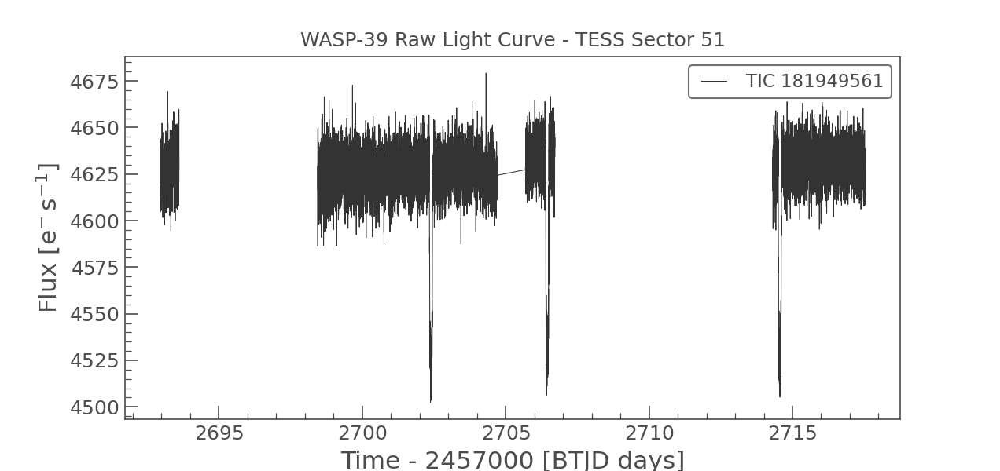
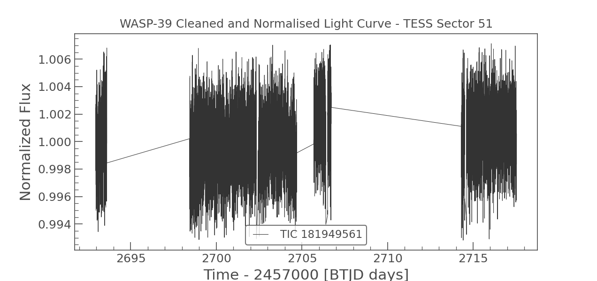
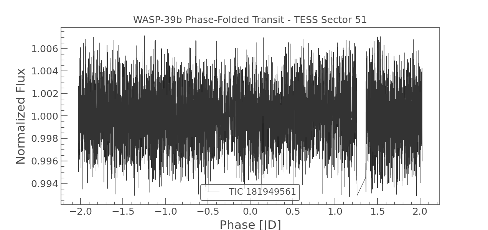
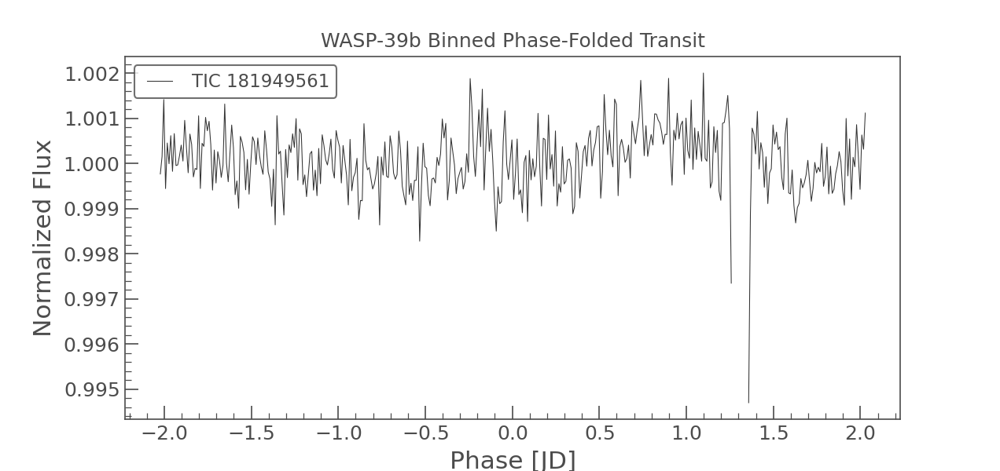

# Exoplanet Transit Photometry

Independent computational astrophysics project analysing real TESS satellite 
data to detect and characterise exoplanet transits using Python.

## Target
**WASP-39b** — a hot Saturn exoplanet orbiting a G-type star ~700 light years away.

## What This Project Does
1. Downloads real photometric data from NASA TESS satellite using Lightkurve
2. Cleans and normalises the light curve (removes NaNs and outliers)
3. Phase-folds the light curve on the known orbital period
4. Bins the folded light curve to reduce noise
5. Measures transit depth and orbital period

## Results
| Parameter | Value |
|---|---|
| Target Star | WASP-39 (TIC 181949561) |
| TESS Sector | 51 (2022) |
| Orbital Period | 4.0552941 days |
| Transit Depth | ~1.3% flux decrease |
| Data Points | 7,784 (after cleaning) |

## Plots
### Raw Light Curve

### Cleaned and Normalised Light Curve

### Phase-Folded Transit

### Binned Phase-Folded Transit

## Tools Used
- Python 3
- Lightkurve 2.6.0
- NumPy
- Matplotlib
- TESS SPOC pipeline data

## Background
This project was developed as an independent study in computational 
astrophysics, building practical skills in astronomical data analysis 
relevant to ISM/IGM research. Transit photometry demonstrates core 
techniques used across observational astrophysics — time-series analysis, 
signal extraction from noisy data, and period detection.

## Author
Rachala Karthik  
BTech Electronics and Communication Engineering  
Vignan Institute of Technology and Science, Hyderabad